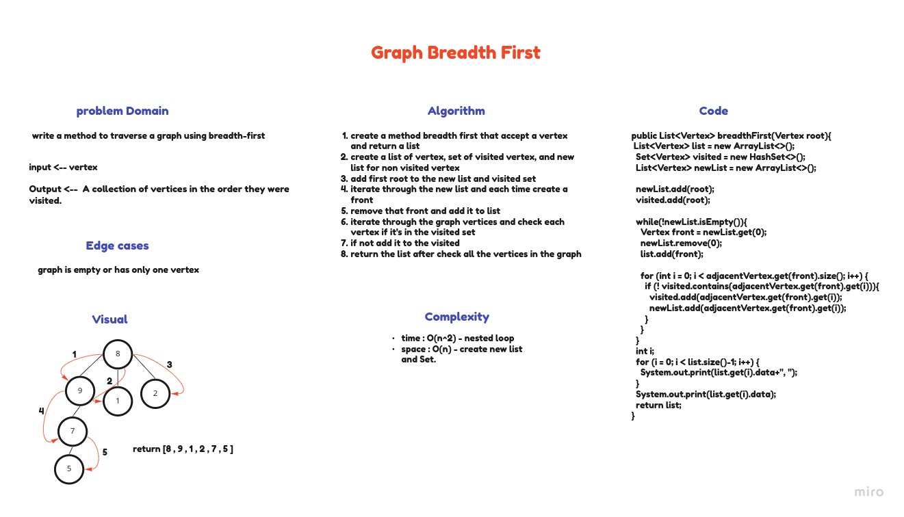

# Graphs
A graph is a non-linear data structure that can be looked at as a collection of vertices (or nodes) potentially connected by line segments named edges.

## Challenge
Implement Graph as adjacent list, and include the following methods:

**addNode**: The added node Add a node to the graph

**addEdge**: 2 nodes to be connected by the edge, weight (optional)
add new edge between two nodes in the graph If specified, assign a weight to the edge Both nodes should already be in the Graph

**getNodes**: returns all the nodes in the graph as a collection (set, list, or similar)

**getNeighbors**: accept a node and returns a collection of edges connected to the given node Include the weight of the connection in the returned collection

**size**: returns the total number of nodes in the graph

## Approach & Efficiency

**addNode**: time = O(1), space = O(n).

**addEdge**: time = O(1), space = O(1).

**getNodes**: time = O(n), space = O(n).

**getNeighbors**: time = O(1), space = O(1).

**size**: time = O(1), space = O(1).

## API

**addNode**: this method used to add a new node to the graph.

**addEdge**: this method used to add a new edge between two Nodes in the graph.

**getNodes**: this method returns a HashSet which contains all the Nodes in the graph.

**getNeighbors**: this method return a list of all the Nodes that are connected to the Node we pass.

**size**: this method returns the size of the graph HashSet.

# Graphs Breadth-first

## Challenge
write a method to traverse a graph using breadth-first

input -> Node

output -> A collection of nodes in the order they were visited.

## Whiteboard Process

## Approach & Efficiency
- time : O(n^2) - nested loop
- space : O(n) - create new list and Set.
