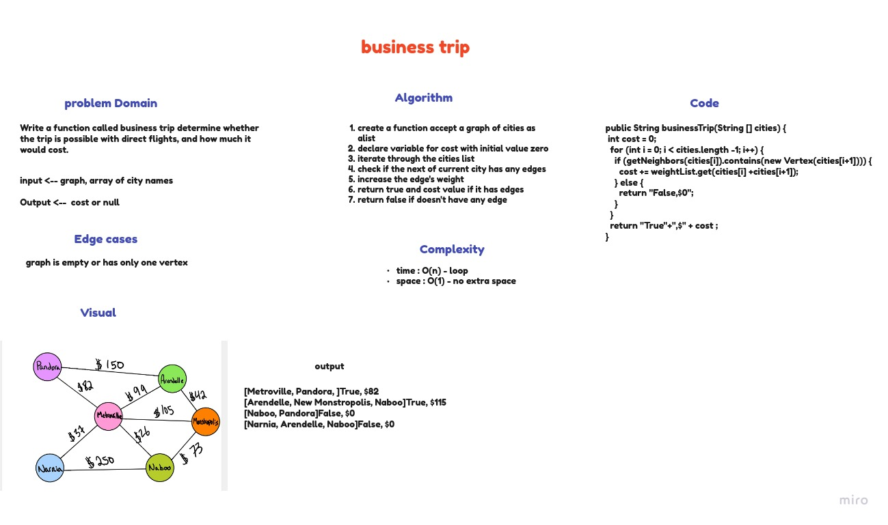

# Graphs
A graph is a non-linear data structure that can be looked at as a collection of vertices (or Vertex) potentially connected by line segments named edges.

## Challenge
Implement Graph as adjacent list, and include the following methods:

**addVertex**: The added Vertex Add a Vertex to the graph

**addEdge**: 2 Vertex to be connected by the edge, weight (optional)
add new edge between two Vertex in the graph If specified, assign a weight to the edge Both Vertex should already be in the Graph

**getVertex**: returns all the Vertex in the graph as a collection (set, list, or similar)

**getNeighbors**: accept a Vertex and returns a collection of edges connected to the given Vertex Include the weight of the connection in the returned collection

**size**: returns the total number of Vertex in the graph

## Approach & Efficiency

**addVertex**: time = O(1), space = O(n).

**addEdge**: time = O(1), space = O(1).

**getVertex**: time = O(n), space = O(n).

**getNeighbors**: time = O(1), space = O(1).

**size**: time = O(1), space = O(1).

## API

**addVertex**: this method used to add a new Vertex to the graph.

**addEdge**: this method used to add a new edge between two Vertex in the graph.

**getVertex**: this method returns a HashSet which contains all the Vertex in the graph.

**getNeighbors**: this method return a list of all the Vertex that are connected to the Vertex we pass.

**size**: this method returns the size of the graph HashSet.

# Graphs Breadth-first

## Challenge
write a method to traverse a graph using breadth-first

input -> Vertex
output -> A collection of vertices in the order they were visited.

## Whiteboard Process

## Approach & Efficiency
- time : O(n^2) - nested loop
- space : O(n) - create new list and Set.

# business trip

## Challenge
Write a function called business trip Determine whether the trip is possible with direct flights, and how much it would cost.

input -> graph, array of city names
output -> cost or null

## Whiteboard Process

## Approach & Efficiency
- time : O(n) - loop.
- space : O(1) - no extra space.
