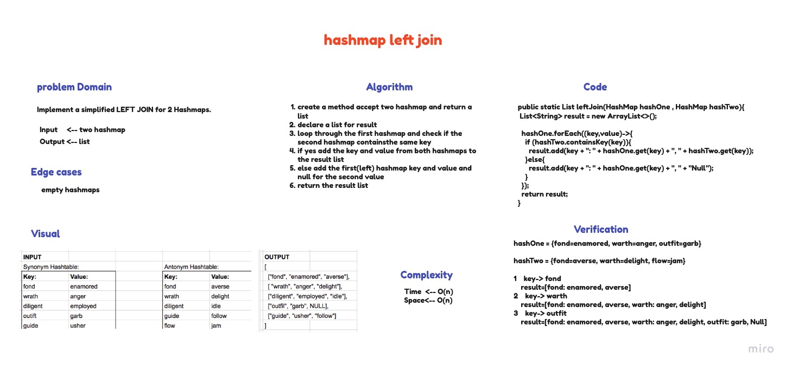

# Hashmap left join

## Challenge
Implement a simplified LEFT JOIN for 2 Hashmaps into a single data structure.

## Whiteboard Process

## Approach & Efficiency
 - Time complexity:  O(n)
 - Space complexity: O(n)

## Code
[Hashmap left join](lib/src/main/java/hashmap/left/join/LeftJoin.java)