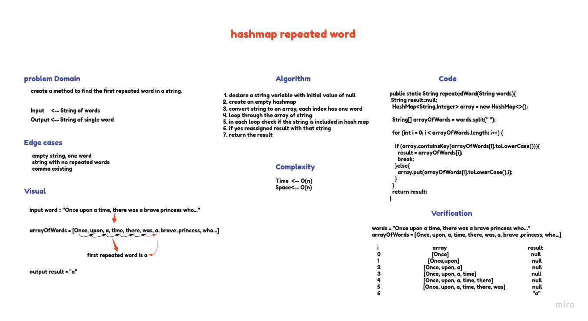

# Hashmap repeated Word

## Challenge
create a method that accept a string of words to find the first repeated word(occurs in the string more than once) and return a string one word.

## Whiteboard Process

## Approach & Efficiency
 - Time complexity:  O(n)
 - Space complexity: O(n)
