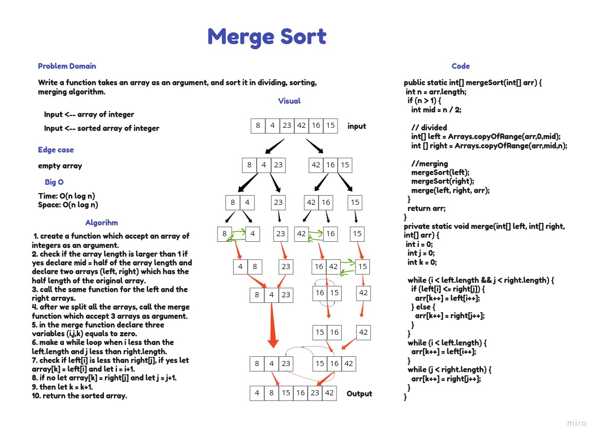

# Challenge Summary: Insertion Sort Code Challenge 26
Write a function takes an array as an argument, and sort it in Insertion Sort algorithm.

## Whiteboard Process

## Approach & Efficiency
the big O notation:
Time: O(n^2)
Space: O(1)

## Blog
[blog](insertionBLOG.md)

## Code
[code](/home/asac/401/data-structures-and-algorithms/java/code_challenges/insertion-sort/lib/src/main/java/insertion/sort/Insertion.java)

# Challenge Summary:Merging Sort Code Challenge 27
write a function which takes an array as an argument, and sort it in dividing sorting and merging algorithm.

## Whiteboard Process

## Approach & Efficiency
the big O notation:
Time: O(n log n)
Space: O(n log n)

## Blog
[blog](mergeBLOG.md)

## Code
[code](/home/asac/401/data-structures-and-algorithms/java/code_challenges/insertion-sort/lib/src/main/java/insertion/sort/Insertion.java)
