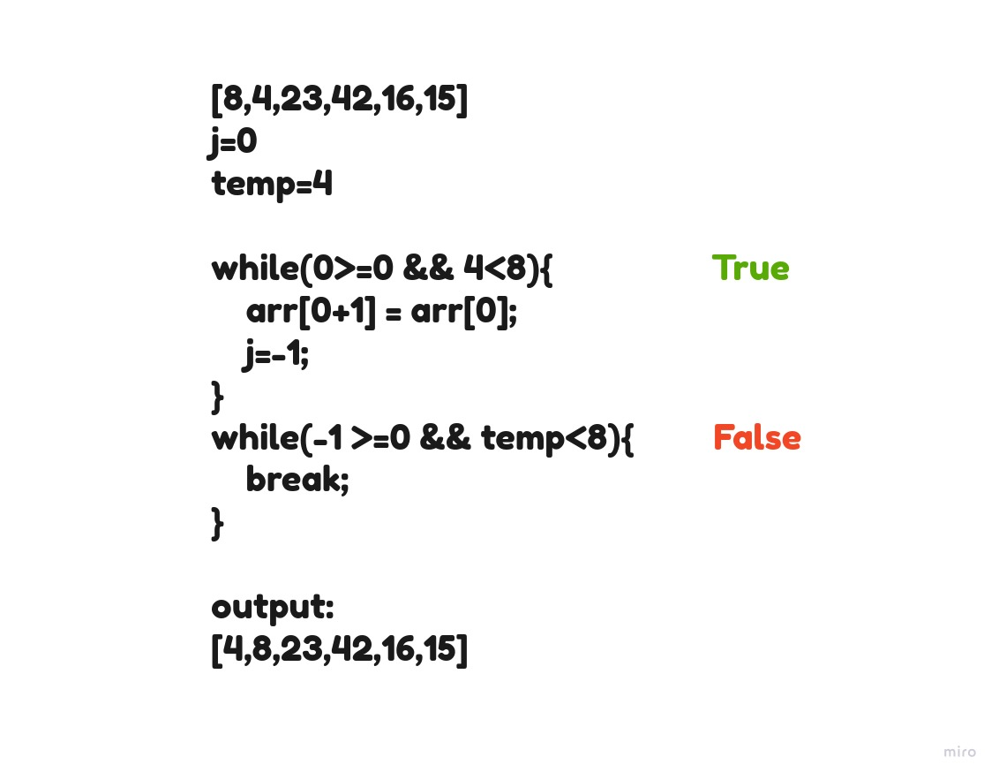
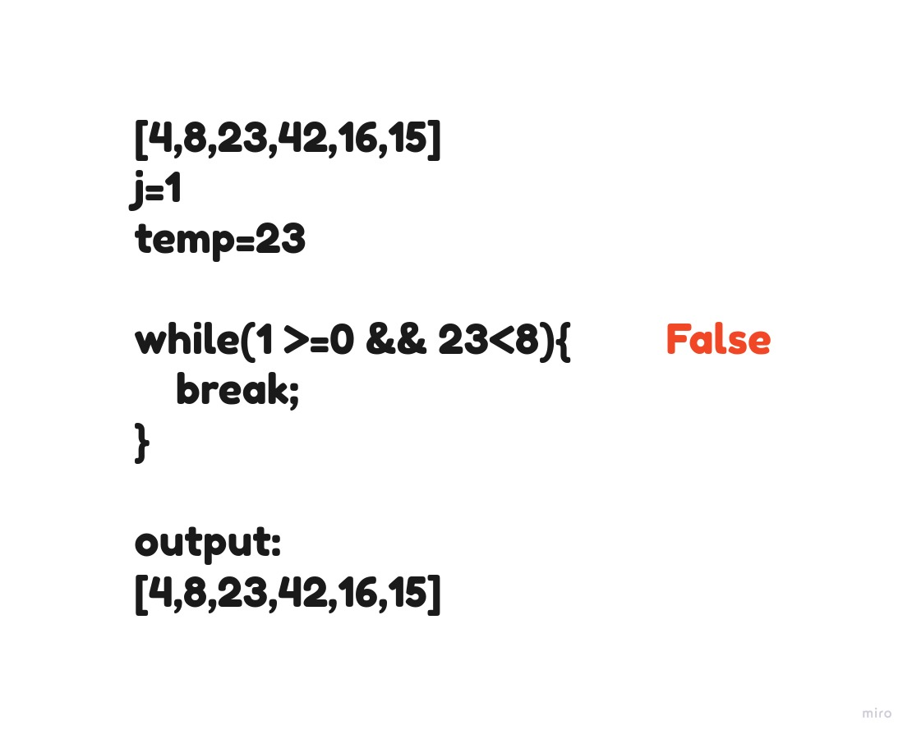
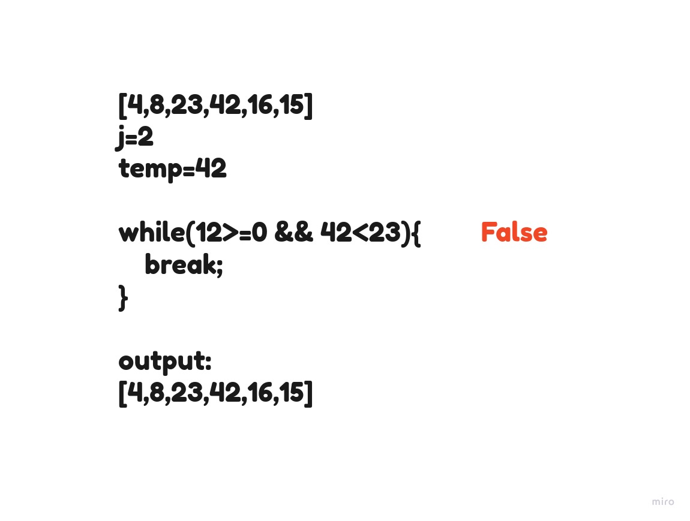
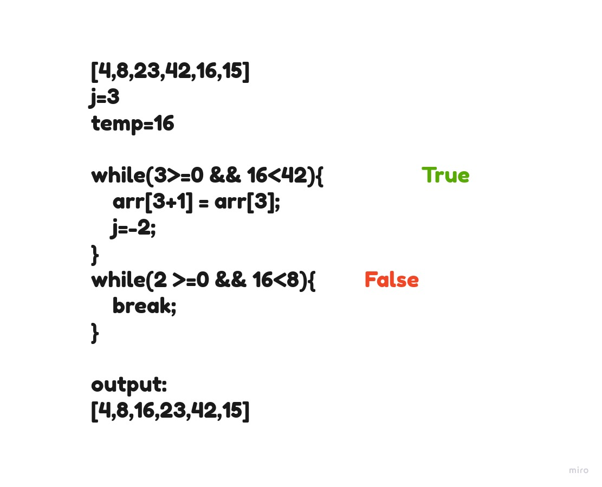
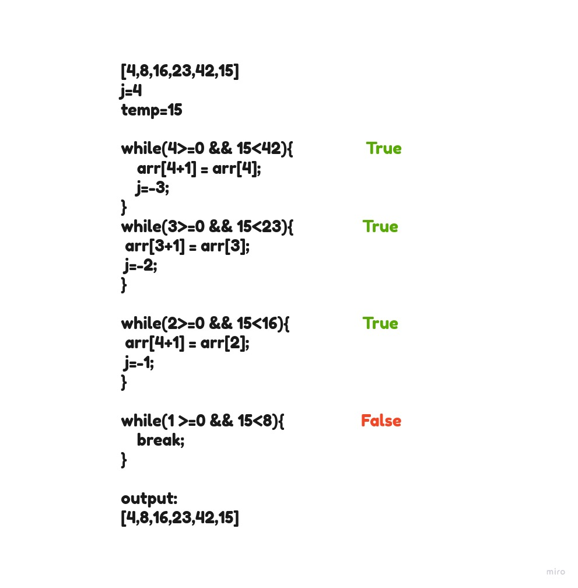

# Insertion Sort
Selection Sort is a sorting algorithm iterate the array multiple times as it slowly builds out the sorting sequence. 

## Pseudocode
```java
SelectionSort(int[] arr)
DECLARE n <-- arr.Length;
FOR i = 0; i to n - 1  
DECLARE min <-- i;
FOR j = i + 1 to n
if (arr[j] < arr[min])
min <-- j;

        DECLARE temp <-- arr[min];
        arr[min] <-- arr[i];
        arr[i] <-- temp;
```


**Pass 1:**

In first pass, look if there is a number smaller than arr[0]=8. arr[1]=4 smaller than 8. The minimum value updated to 4. 





**Pass 2:**

The second pass through the array evaluates the remaining values in the array to see if there is a smaller than 8, but 8 is the 2nd smallest number in the array.so minimum value does not change at all during the iteration of this pass.





**Pass 3:**

The third pass evaluates the remaining indexes in the array if there is elemens less than 23. 15 and 16 are smaller. Each time a smaller number than the current minimum is found, the variable will update to the new smallest number. In this case, 15 is the next smallest number. 




**Pass 4:**

The 4th pass through on the array proves that 16 is the next smallest number in the array, and as a result.





**Pass 5:**

The 5th pass through of the array only has one other index to evaluate. Since the last element value is larger than index 4.




After last iteration, it to break out of the loop and leaving our array now sorted.

**Efficency**
   * Time: O(n^2)
   * Space: O(1)
