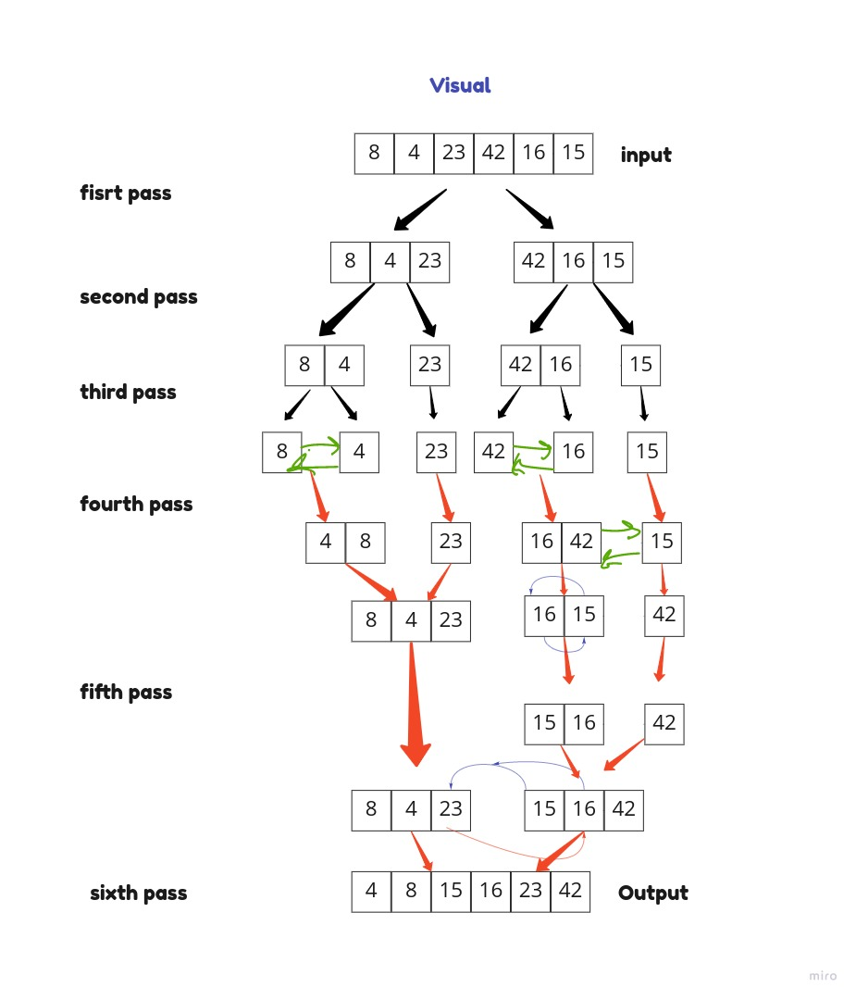

# Merge Sort
sorts an array by dividing it into two halves each time until it's sorted then merge them into one sorted array.

### pseudo code:

```
ALGORITHM Mergesort(arr)
    DECLARE n <-- arr.length

    if n > 1
      DECLARE mid <-- n/2
      DECLARE left <-- arr[0...mid]
      DECLARE right <-- arr[mid...n]
      // sort the left side
      Mergesort(left)
      // sort the right side
      Mergesort(right)
      // merge the sorted left and right sides together
      Merge(left, right, arr)

ALGORITHM Merge(left, right, arr)
    DECLARE i <-- 0
    DECLARE j <-- 0
    DECLARE k <-- 0

    while i < left.length && j < right.length
        if left[i] <= right[j]
            arr[k] <-- left[i]
            i <-- i + 1
        else
            arr[k] <-- right[j]
            j <-- j + 1

        k <-- k + 1

    if i = left.length
       set remaining entries in arr to remaining values in right
    else
       set remaining entries in arr to remaining values in left
```

### tracing:

`Input: [8, 4, 23, 42, 16, 15]`

**Pass1:**
divide the array into two halves.

**Pass2:**
divide both arrays for the second time, got 4 arrays.

**Pass3:**
divide all arrays for 3rd time, got 6 arrays.

**Pass:4**
compare and sort the left side.

**Pass:5**
compare and sort the right side.

**Pass:6**
the sorting is finished now we merge the arrays.

### visual tracing


### Big O notation:

Time: O(n log n)
Space: O(n log n)
